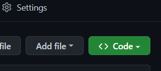
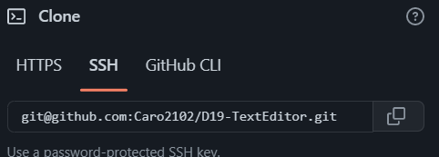
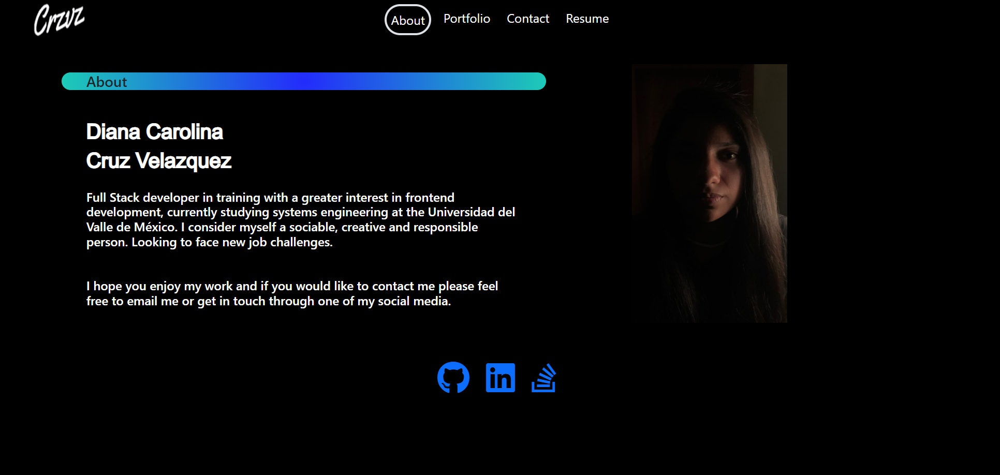
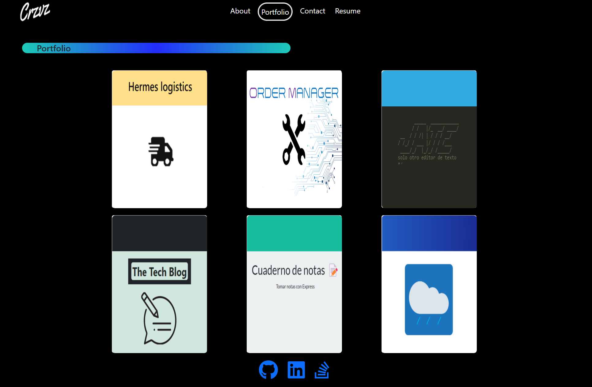
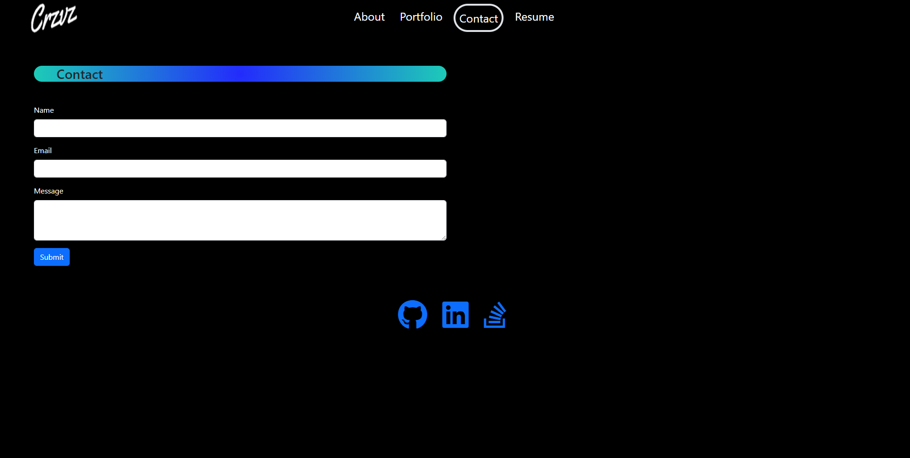
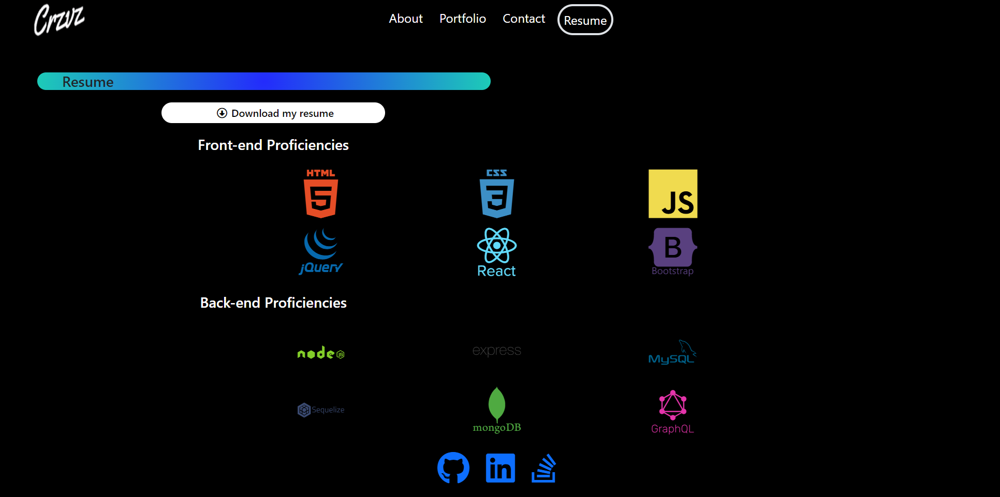

# D19-TextEditor
Editor de texto para crear notas o fragmentos de código con o sin conexión a Internet

---
  ## Contenido
  1. [Enlaces](#enlaces)
  2. [Instalación](#instalación)
  3. [Apariencia](#apariencia)
  4. [Contribución](#contribución)
  
---
## Enlaces

**[Enlace con la aplicación desplegada  ](https://caro2102.github.io/react-portafolio/  "click")**.

**[URL de repositorio de GitHub](https://github.com/Caro2102/react-portafolio/tree/main "click")**.

---
  ## Instalación
- Clonar repositorio
    - Abrir el siguiente link **[URL de repositorio de GitHub](https://github.com/Caro2102/react-portafolio/tree/main "click")**.
    - Hacer click en <> Code.

        
    - Copiar la direccion URL del repositorio.

        
    - Abrir GitBash.
    - Ir a la ubicacion en donde quieres clonar el repositorio.
    - Escribir **`git clone`** y pegar la url antes copiada.
    - Presionar enter para clonar.
    - Instalar node desde la pagina oficial **[NodeJS web Oficial](https://nodejs.org/es/ "click")**.
    - Abrir GitBash.
    - Ir a la ubicacion en donde se clonó el repositorio.
    - Escribir **`npm run install`** para instalar todas las dependencias del proyecto.
        - Con esto instalaremos todas las dependecias que tengamos en los package.json tanto general, cliente y servidor y nos creará carpetas llamadas **node_modules** con las dependencias listas para utilizar.
    - Escribir **`npm start`** para ejecutar el archivo.

---
## Apariencia
1. Despues de seguir los pasos de [Instalación](#instalación) y haber ejecutado el programa ó ingresado desde la aplicación en **[GitHub pages ](https://caro2102.github.io/react-portafolio/  "click")**.
2. La aplicación se verá de esta manera.

    
    
    
    

---
## Contribución:
    
  Para contribuir con este proyecto:
- Fork del repositorio.
- Clonar el  repositorio.
- Actualizar la rama master.

        $git pull -r upstream master
- Crear rama.

        $ git checkout -b feature-nombre-rama
- Realizar cambios, agregarlos, hacer commit y despues hacer push hacia nuestro repositorio indicando la rama que hemos creado.

        $ git push origin feature-nombre-rama
- Hacer un Pull Request.
- Esperar que el codigo se acepte y se haga merge.

